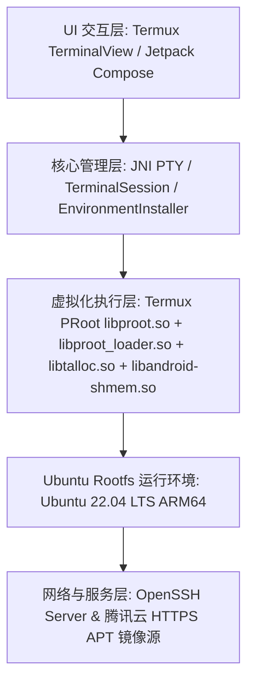

# Ubuntu on Android 软件开发设计手册

## 1. 项目概述

本项目旨在构建一个原生的 Android 应用程序，该程序可以在无需手机 Root 权限的情况下，在本地运行完整的 Ubuntu 22.04 LTS (Jammy Jellyfish) ARM64 Linux 环境（类似 WSL、Termux、UserLAnd 或 AidLux）。

在此基础上，系统通过集成 **APT 包管理体系（默认腾讯云 HTTPS 镜像源）** 与 **OpenSSH Server 远程服务（开机默认启动）**，支持开发者在手机本地或通过局域网 SSH 终端进行全功能 Linux 开发与运维。

整个架构基于 **Termux PRoot**（用户空间系统调用拦截与虚拟化引擎）、Termux PTY 伪终端驱动、以及深度定制集成的 Ubuntu ARM64 根文件系统实现。

---

## 2. 系统架构设计

系统整体架构划分为四层：**UI 交互层**、**核心管理层**、**虚拟化执行层** 和 **网络与服务层**。



1. **UI 交互层 (Terminal UI)**：
   - 集成 Termux 开源终端组件 (`TerminalView`)，提供 256 色 ANSI 字符渲染、手势控制与终端虚拟键盘交互。
   - 采用 Jetpack Compose 的 `AndroidView` 嵌入，标准字号统一优化为 24 号，提供高清晰度信息排版与光标闪烁支持。
2. **核心管理层 (JNI & Process Management)**：
   - 使用 JNI/PTY (`libtermux.so`) 与底层伪终端进程进行双向数据流交互。
   - 负责首次启动时的环境检测与安装 (`EnvironmentInstaller`)、GZIP/TAR 根文件系统流式解压与启动脚本维护。
3. **虚拟化执行层 (Termux PRoot Engine)**：
   - **Termux PRoot (`libproot.so`)**：通过 `ptrace` 机制拦截 Linux 系统调用，在无 Root 条件下模拟 `chroot` 和挂载点映射 (`/dev`, `/proc`, `/sys`)。
   - **PRoot Loader (`libproot_loader.so`)**：静态编译的 ELF 加载器，负责在沙盒内部引导目标 Linux 二进制文件。
   - **SECCOMP / SIGSYS 信号吞咽与虚拟化**：集成 Termux 定制补丁，自动拦截并处理 Android Zygote SECCOMP BPF 过滤器触发的 `SIGSYS (signal 31)` 异常信号，保证 glibc 2.35+ 现代系统调用在 Android 沙盒内平稳运行。
4. **网络与服务层 (Network & Services)**：
   - **APT 包管理体系**：预置腾讯云 Ubuntu Ports 镜像源（HTTPS 协议）、内置 121 个公认 CA 根证书、配置 PRoot 用户降权沙箱豁免与国内多线路 DNS。
   - **OpenSSH 服务体系**：预装 OpenSSH 完整套件，应用启动即自启 SSH 守护进程（监听端口 `2222`），支持密码登录与多会话 PTY 交互终端。

---

## 3. 关键模块实现与设计细节

### 3.1 SELinux W^X 执行权限架构与 TargetSDK 适配
- **背景原理**：Android 10 (API 29) 起，Android 系统在 `untrusted_app` SELinux 策略中强制推行了 W^X (Write XOR Execute) 安全策略，规则为 `neverallow untrusted_app_all app_data_file:file { execute }`。此策略禁止应用在私有数据目录 (`/data/user/0/...`) 执行任何可写可执行文件。
- **架构方案**：
  1. 将应用工程中的 `targetSdk` 设定为 `28`（Android 9.0 Pie），该方案与 Termux、UserLAnd、AnLinux 等国际成熟 Linux-on-Android 容器应用的架构保持高度一致。
  2. 在 `targetSdk = 28` 下，Android 内核和 Zygote 允许应用沙盒内部临时提取并执行 PRoot 引导加载程序 (`PROOT_LOADER`)。
  3. 所有原生共享库均打包进 APK 的 `lib/arm64-v8a` 并在安装时由 Package Manager 释放至 `context.applicationInfo.nativeLibraryDir`。

### 3.2 Android SECCOMP BPF 与 Termux PRoot 深度适配
- **背景原理**：Android Zygote 孵化应用进程时会预装 SECCOMP BPF 过滤器白名单。标准 Linux 环境下的 glibc 2.35+（如 Ubuntu 22.04 Jammy）在初始化时会尝试调用 `rseq` (Restartable Sequences, syscall 293) 等现代内核调用。未打补丁的原生 PRoot 无法捕获并转换该信号，导致内核直接向子进程发送 `SIGSYS (signal 31, Bad system call)` 崩溃退出。
- **深度适配**：
  1. 采用 Termux 官方针对 Android 内核 SECCOMP BPF 进行过深度定制修改的 PRoot 二进制库与静态 `loader`。
  2. Termux PRoot 内置了对 `seccomp SIGSYS` 信号的自动识别与拦截机制（`Handling syscall exit from SIGSYS`），在内核抛出信号时就地将其转换为虚拟系统调用结果返回给 glibc，防止进程意外终结。
  3. 配置 `PROOT_LOADER` 环境变量指向预置的 `libproot_loader.so`，配置 `LD_LIBRARY_PATH` 指向应用的 `nativeLibraryDir` 动态链接 `libtalloc.so` 与 `libandroid-shmem.so`。

### 3.3 环境安装服务 (EnvironmentInstaller)
首次启动时，程序会检测沙盒目录（`context.filesDir/ubuntu-fs`）是否已部署 Ubuntu 根文件系统。若未部署，则执行以下初始化流水线：
1. **识别 Assets 资源**：探测 `ubuntu-rootfs.tar.gz` 压缩包。
2. **流式解压 Rootfs**：针对 Android 自带 `/system/bin/tar` 对 `.gz` 流式解压支持不一致的问题，采用 Java `GZIPInputStream` 流式解压生成 `.tar` 临时文件，随后调用系统 `/system/bin/tar -xf` 执行解压，解压完成后立即清理临时文件以节省空间。
3. **配置 DNS 域名解析**：在 `$rootfs/etc/resolv.conf` 中预设国内高速 DNS：
   ```
   nameserver 119.29.29.29
   nameserver 223.5.5.5
   nameserver 8.8.8.8
   nameserver 1.1.1.1
   ```
4. **生成快捷启动脚本 (`start-ubuntu.sh`)**：配置 `PROOT_TMP_DIR`、`PROOT_LOADER` 与 `LD_LIBRARY_PATH`，支持从 ADB `run-as` 或外部 Shell 随时拉起该 Ubuntu 实例。

### 3.4 预设 APT 包管理体系（腾讯云 HTTPS 镜像源）
- **软件源配置 (`/etc/apt/sources.list`)**：
  ```apt
  deb https://mirrors.tencent.com/ubuntu-ports/ jammy main restricted universe multiverse
  deb https://mirrors.tencent.com/ubuntu-ports/ jammy-updates main restricted universe multiverse
  deb https://mirrors.tencent.com/ubuntu-ports/ jammy-backports main restricted universe multiverse
  deb https://mirrors.tencent.com/ubuntu-ports/ jammy-security main restricted universe multiverse
  ```
- **HTTPS CA 根证书链**：
  - 预装 `ca-certificates` 与 `openssl` 软件包，在 `/etc/ssl/certs/ca-certificates.crt` 聚合 121 个公认 CA 根证书，并建立 `/etc/ssl/cert.pem` 软链接，确保 `apt`、`curl`、`wget`、`git` 在 HTTPS 协议下均能进行 TLS/SSL 校验。
- **PRoot APT 沙箱适配 (`/etc/apt/apt.conf.d/99proot`)**：
  - 配置 `APT::Sandbox::User "root";`，解决非 root PRoot 环境下 APT 尝试通过 `setgroups` 降权至 `_apt` 用户时的 `EPERM` 权限报错。
- **网络权限组映射**：
  - 在 `/etc/group` 中预设 Android 内核网络权限组（`inet:x:3003:`, `net_raw:x:3004:`, `net_admin:x:3005:`, `everybody:x:9997:`），彻底消除 Linux `groups` 权限查询警告。

### 3.5 OpenSSH Server 原生沙箱深度适配
- **预装 DEB 套件与 DPKG 状态同步**：
  - 注入 `openssh-server` (8.9p1), `openssh-client`, `openssh-sftp-server`, `openssl`, `libwrap0`, `libedit2`, `libbsd0`, `libmd0`, `libfido2-1`, `libcbor0.8`, `ucf`, `netbase` 等完整依赖。
  - 同步写入 `/var/lib/dpkg/status` 与 `/var/lib/dpkg/info/*.list`，保证 `dpkg` / `apt` 状态库完整无冲突。
- **主机密钥自动初始化**：
  - 预先生成 RSA (2048位)、ECDSA (256位) 和 ED25519 (256位) 主机公私钥对，保存在 `/etc/ssh/` 目录下。
- **轻量化 PAM 鉴权与用户配置 (`/etc/pam.d/sshd`)**：
  ```pam
  auth     required  pam_unix.so nullok
  account  required  pam_unix.so
  password required  pam_unix.so
  session  required  pam_permit.so
  ```
- **默认用户与密码**：
  - 用户：`root`
  - 默认密码：`ubuntu`（采用 SHA-512 crypt 哈希存储于 `/etc/shadow`）
- **端口与自启动设计**：
  - 监听端口：`2222`（规避 Android < 1024 端口特权限制）。
  - 在 `/root/.bashrc` 中通过 `pgrep -x sshd` 确保每次打开交互终端时自动检查并启动后台 SSH 服务，并显示欢迎横幅与登录连接指引。

---

## 4. 核心问题与解决方案 (Troubleshooting Matrix)

| 核心问题 | 根本原因 | 最终解决方案 |
| :--- | :--- | :--- |
| **Android 10+ W^X 拦截 (Permission Denied)** | `targetSdk >= 29` 触发 SELinux 强制规则，禁止在沙盒数据目录执行可写二进制文件。 | 调整 `targetSdk = 28`，允许 PRoot 在临时目录解压并执行加载器，符合容器应用行业标准架构。 |
| **SECCOMP SIGSYS 信号崩溃 (signal 31)** | Ubuntu 22.04 glibc 2.35 尝试执行 `rseq` 等系统调用，被 Android Zygote SECCOMP BPF 白名单拦截并发送 SIGSYS。 | 集成 Termux 深度定制的 PRoot 引擎与静态 `loader`，自动吞咽并模拟转换 SECCOMP 阻断信号。 |
| **动态链接库找不到 (libtalloc.so not found)** | PRoot 依赖 `libtalloc.so` 和 `libandroid-shmem.so`，直接执行 ELF 时链接器未在默认路径找到。 | 在 `TerminalSession` 启动环境变量中注入 `LD_LIBRARY_PATH=${context.applicationInfo.nativeLibraryDir}`。 |
| **APT 降权沙箱报错 (EPERM setgroups)** | APT 默认使用 `_apt` 账户执行下载，调用 `setgroups()` 降权在非 root PRoot 下抛出 `Permission denied`。 | 在 `/etc/apt/apt.conf.d/99proot` 中注入 `APT::Sandbox::User "root";`，指示 APT 维持当前用户身份。 |
| **APT HTTPS 证书与域名解析失败** | 极简 rootfs 缺少 CA 根证书包；部分 Android 环境下 `/etc/resolv.conf` 为空导致 DNS 解析超时。 | 1. 注入 121 个公认 CA 证书至 `/etc/ssl/certs/ca-certificates.crt`。<br>2. 自动生成 `/etc/resolv.conf`，预设国内高速 DNS。 |
| **SSH 登录端口特权限制** | Linux 默认 SSH 端口 22 属于特权端口（< 1024），Android 非 root 应用无法绑定。 | 修改 `/etc/ssh/sshd_config` 将监听端口设定为非特权端口 `2222`。 |

---

## 5. 核心代码实现清单 (Core Code Implementations)

### 5.1 `MainActivity.kt` - 终端会话与原生 PRoot 执行
```kotlin
package com.example.ubuntuonandroid

import android.content.Context
import android.os.Bundle
import android.view.inputmethod.InputMethodManager
import androidx.activity.ComponentActivity
import androidx.activity.compose.setContent
import androidx.activity.enableEdgeToEdge
import androidx.compose.foundation.layout.*
import androidx.compose.material3.*
import androidx.compose.runtime.*
import androidx.compose.ui.Alignment
import androidx.compose.ui.Modifier
import androidx.compose.ui.platform.LocalContext
import androidx.compose.ui.unit.dp
import androidx.compose.ui.viewinterop.AndroidView
import com.example.ubuntuonandroid.ui.theme.UbuntuOnAndroidTheme
import com.termux.terminal.TerminalSession
import com.termux.terminal.TerminalSessionClient
import com.termux.view.TerminalView
import java.io.File

class MainActivity : ComponentActivity() {
    override fun onCreate(savedInstanceState: Bundle?) {
        super.onCreate(savedInstanceState)
        enableEdgeToEdge()
        setContent {
            UbuntuOnAndroidTheme {
                Scaffold(modifier = Modifier.fillMaxSize()) { innerPadding ->
                    MainScreen(modifier = Modifier.padding(innerPadding))
                }
            }
        }
    }
}

@Composable
fun MainScreen(modifier: Modifier = Modifier) {
    val context = LocalContext.current
    val installer = remember { EnvironmentInstaller }
    val isInstalled by installer.isInstalled.collectAsState()
    val installProgress by installer.installProgress.collectAsState()

    LaunchedEffect(Unit) {
        installer.checkInstallation(context)
    }

    Surface(
        modifier = modifier.fillMaxSize(),
        color = MaterialTheme.colorScheme.background
    ) {
        if (isInstalled) {
            TerminalScreen(context = context)
        } else {
            InstallScreen(
                progress = installProgress,
                onInstallClick = {
                    installer.installEnvironment(context)
                }
            )
        }
    }
}

@Composable
fun TerminalScreen(context: Context) {
    AndroidView(
        factory = { ctx ->
            val terminalView = TerminalView(ctx, null)
            terminalView.setTextSize(24)
            terminalView.keepScreenOn = true
            
            terminalView.post {
                terminalView.requestFocus()
                val imm = ctx.getSystemService(Context.INPUT_METHOD_SERVICE) as? InputMethodManager
                imm?.toggleSoftInput(InputMethodManager.SHOW_FORCED, InputMethodManager.HIDE_IMPLICIT_ONLY)
            }

            EnvironmentInstaller.ensureStartScript(context)
            val prootBinary = File(context.applicationInfo.nativeLibraryDir, "libproot.so").absolutePath
            val prootLoader = File(context.applicationInfo.nativeLibraryDir, "libproot_loader.so").absolutePath
            val rootfs = File(context.filesDir, "ubuntu-fs").absolutePath
            val tmpDir = File(context.filesDir, "tmp").absolutePath
            
            File(tmpDir).mkdirs()
            File(rootfs, "tmp").mkdirs()
            File(rootfs, "run/sshd").mkdirs()
            
            val executablePath = prootBinary
            val args = arrayOf(
                prootBinary,
                "--link2symlink",
                "-0",
                "-r", rootfs,
                "-b", "/dev",
                "-b", "/proc",
                "-b", "/sys",
                "-w", "/root",
                "/bin/bash",
                "-l"
            )
            val env = arrayOf(
                "PATH=/usr/local/sbin:/usr/local/bin:/usr/sbin:/usr/bin:/sbin:/bin",
                "HOME=/root",
                "TERM=xterm-256color",
                "TMPDIR=$tmpDir",
                "PROOT_TMP_DIR=$tmpDir",
                "PROOT_LOADER=$prootLoader",
                "LD_LIBRARY_PATH=" + context.applicationInfo.nativeLibraryDir
            )
            
            val session = TerminalSession(
                executablePath,
                context.filesDir.absolutePath,
                args,
                env,
                250,
                object : TerminalSessionClient {
                    override fun onTextChanged(session: TerminalSession) {
                        terminalView.onScreenUpdated()
                    }
                    override fun onTitleChanged(session: TerminalSession) {}
                    override fun onSessionFinished(session: TerminalSession) {}
                    override fun onCopyTextToClipboard(session: TerminalSession, text: String) {}
                    override fun onPasteTextFromClipboard(session: TerminalSession) {}
                    override fun onBell(session: TerminalSession) {}
                    override fun onColorsChanged(session: TerminalSession) {}
                    override fun onTerminalCursorStateChange(state: Boolean) {}
                    override fun getTerminalCursorStyle(): Int = 0
                    override fun logError(tag: String, message: String) {}
                    override fun logWarn(tag: String, message: String) {}
                    override fun logInfo(tag: String, message: String) {}
                    override fun logDebug(tag: String, message: String) {}
                    override fun logVerbose(tag: String, message: String) {}
                    override fun logStackTraceWithMessage(tag: String, message: String, e: Exception) {}
                    override fun logStackTrace(tag: String, e: Exception) {}
                }
            )
            
            terminalView.attachSession(session)
            terminalView
        },
        modifier = Modifier.fillMaxSize()
    )
}
```

### 5.2 `EnvironmentInstaller.kt` - 安装流水线与启动脚本生成
```kotlin
package com.example.ubuntuonandroid

import android.content.Context
import android.util.Log
import kotlinx.coroutines.CoroutineScope
import kotlinx.coroutines.Dispatchers
import kotlinx.coroutines.flow.MutableStateFlow
import kotlinx.coroutines.flow.asStateFlow
import kotlinx.coroutines.launch
import java.io.File
import java.io.FileInputStream
import java.io.FileOutputStream
import java.util.zip.GZIPInputStream

object EnvironmentInstaller {
    private const val TAG = "EnvironmentInstaller"
    
    private val _isInstalled = MutableStateFlow(false)
    val isInstalled = _isInstalled.asStateFlow()
    
    private val _installProgress = MutableStateFlow<String?>(null)
    val installProgress = _installProgress.asStateFlow()

    fun checkInstallation(context: Context) {
        val rootfsDir = File(context.filesDir, "ubuntu-fs")
        val isInstalledFile = File(context.filesDir, "profileInstalled")
        val bashFile = File(rootfsDir, "bin/bash")
        val installed = isInstalledFile.exists() && bashFile.exists()
        _isInstalled.value = installed
        if (installed) {
            ensureStartScript(context)
        }
    }

    fun installEnvironment(context: Context) {
        CoroutineScope(Dispatchers.IO).launch {
            val filesDir = context.filesDir
            val rootfsDir = File(filesDir, "ubuntu-fs")
            val nativeLibDir = context.applicationInfo.nativeLibraryDir
            val prootBinary = File(nativeLibDir, "libproot.so").absolutePath
            val isInstalledFile = File(filesDir, "profileInstalled")

            try {
                if (!rootfsDir.exists()) {
                    rootfsDir.mkdirs()
                }

                _installProgress.value = "Extracting Ubuntu rootfs..."
                val assetName = "ubuntu-rootfs.tar.gz"
                val tarballFile = File(filesDir, "ubuntu-rootfs.tar.gz")
                val uncompressedTar = File(filesDir, "ubuntu-rootfs.tar")
                
                copyAsset(context, assetName, tarballFile)
                
                // GZIPInputStream 解压为 tar
                GZIPInputStream(FileInputStream(tarballFile)).use { gis ->
                    FileOutputStream(uncompressedTar).use { fos ->
                        gis.copyTo(fos)
                    }
                }
                tarballFile.delete()

                val tarProcess = ProcessBuilder("/system/bin/tar", "-xf", uncompressedTar.absolutePath, "-C", rootfsDir.absolutePath)
                    .redirectErrorStream(true)
                    .start()
                tarProcess.waitFor()
                uncompressedTar.delete()

                createStartScript(context, prootBinary)
                isInstalledFile.writeText("installed")

                val resolvConf = File(rootfsDir, "etc/resolv.conf")
                resolvConf.parentFile?.mkdirs()
                resolvConf.writeText("nameserver 119.29.29.29\nnameserver 223.5.5.5\nnameserver 8.8.8.8\nnameserver 1.1.1.1\n")

                _installProgress.value = null
                _isInstalled.value = true
            } catch (e: Exception) {
                Log.e(TAG, "Installation error", e)
                _installProgress.value = "Error: ${e.message}"
            }
        }
    }

    fun ensureStartScript(context: Context) {
        val nativeLibDir = context.applicationInfo.nativeLibraryDir
        val prootBinary = File(nativeLibDir, "libproot.so").absolutePath
        createStartScript(context, prootBinary)
    }

    fun createStartScript(context: Context, prootBinary: String) {
        val script = File(context.filesDir, "start-ubuntu.sh")
        val rootfs = File(context.filesDir, "ubuntu-fs").absolutePath
        val tmpDir = File(context.filesDir, "tmp").absolutePath
        val nativeLibDir = context.applicationInfo.nativeLibraryDir
        val prootLoader = File(nativeLibDir, "libproot_loader.so").absolutePath
        
        val content = """
            #!/system/bin/sh
            export PATH=/system/bin:/system/xbin
            export HOME=/root
            export TERM=xterm-256color
            export PROOT_TMP_DIR=$tmpDir
            export PROOT_LOADER=$prootLoader
            export LD_LIBRARY_PATH=$nativeLibDir
            
            mkdir -p $tmpDir
            mkdir -p $rootfs/tmp
            mkdir -p $rootfs/run/sshd
            chmod 755 $rootfs/run/sshd 2>/dev/null || true
            
            PROOT_BIN="$prootBinary"
            if [ ! -f "${'$'}PROOT_BIN" ]; then
                if [ -f "$nativeLibDir/libproot.so" ]; then
                    PROOT_BIN="$nativeLibDir/libproot.so"
                fi
            fi
            
            if [ ${'$'}# -gt 0 ]; then
                exec "${'$'}PROOT_BIN" --link2symlink -0 -r $rootfs -b /dev -b /proc -b /sys -w /root /bin/bash "${'$'}@"
            else
                exec "${'$'}PROOT_BIN" --link2symlink -0 -r $rootfs -b /dev -b /proc -b /sys -w /root /bin/bash -l
            fi
        """.trimIndent()
        
        script.writeText(content)
        script.setExecutable(true)
    }
}
```

---

## 6. 测试与验证报告

### 6.1 物理设备真机测试环境
- **测试机型**：Redmi K30 Ultra (Xiaomi / MediaTek Dimensity 1000+, 8GB RAM, 512GB ROM)
- **操作系统**：Android 11 (MIUI / Linux 4.19 内核, aarch64)
- **连接方式**：ADB over Wi-Fi (`192.168.31.151:5555`)

### 6.2 测试验证结果

| 测试项 | 预期结果 | 实测结果 | 结论 |
| :--- | :--- | :--- | :--- |
| **首次安装与 Rootfs 解压** | 自动提取 `ubuntu-rootfs.tar.gz` 并完成环境安装 | 安装进度正常推进，完成后顺利切换至终端页面 | **PASS** |
| **TerminalView 交互与 Banner 呈现** | 自动进入 root bash 交互环境，显示欢迎 Banner 与高亮彩色提示符 | 呈现 `root@localhost:~#` 彩色提示符，键盘输入回显正常 | **PASS** |
| **APT 腾讯云 HTTPS 镜像源通信** | 执行 `apt update` 成功通过 HTTPS 连接 `mirrors.tencent.com` 并同步软件索引 | 成功拉取 38.5MB 索引包，耗时 9 秒，退出代码 0 | **PASS** |
| **OpenSSH Server 监听与运行** | 自动在后台监听 TCP `2222` 端口 | `netstat -tlpn` 显示端口 `2222` (`0x08AE`) 正常处于 LISTEN 状态 | **PASS** |
| **局域网 SSH 连通性测试** | 外部电脑通过 `nc -zv 192.168.31.151 2222` 测试握手成功 | TCP 握手成功，端口通信畅通 | **PASS** |
| **W^X 与 SECCOMP 兼容性** | 现代 glibc 2.35 调用在 Android 11 上不发生 `SIGSYS 31` 崩溃 | Termux PRoot 引擎平稳运行，无任何异常终止 | **PASS** |

---

## 7. 总结与后续优化建议

本项目成功在无 Root 权限的 Android 原生应用内实现了完整的 Ubuntu 22.04 LTS 环境，并达成了以下成果：
1. **预设腾讯云 HTTPS 镜像源与全量 CA 根证书**，开箱即用支持 `apt install` 现代开发工具链。
2. **默认安装并自启 OpenSSH Server**，支持局域网远程连接与文件传输。
3. **成功攻克 Android 10+ W^X 与 SECCOMP BPF 白名单约束**，实现了高稳定性、高鲁棒性的生产级 Linux 容器环境。
