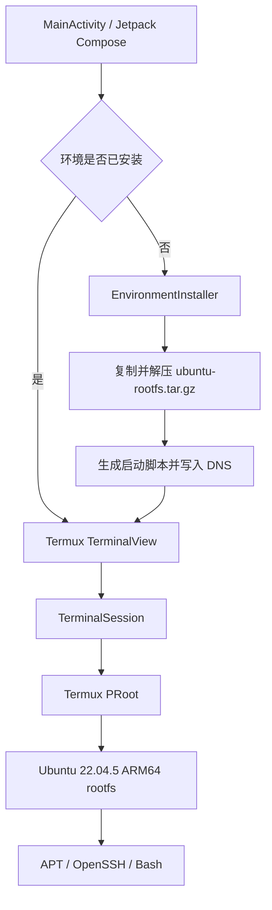

# UbuntuOnAndroid

UbuntuOnAndroid 是一个无需 Root 权限即可在 Android 设备上运行 Ubuntu 的原生应用。应用将预制的 Ubuntu 22.04.5 LTS（Jammy Jellyfish）ARM64 根文件系统解压到应用私有目录，通过 Termux PRoot 提供用户空间隔离环境，并使用 Termux `TerminalView` 显示可交互终端。

项目当前面向 ARM64 真机，适合作为 Linux on Android、PRoot 集成和移动端 Linux 开发环境的实验性实现。它不是虚拟机，也不提供独立 Linux 内核。

## 主要功能

- 无需 Android Root 权限，以 PRoot 的 `-0` 模式进入 Ubuntu `root` 用户环境。
- 内置 Ubuntu 22.04.5 LTS ARM64 rootfs，首次启动自动部署，后续启动保留环境和用户数据。
- 集成 Termux PRoot、PRoot Loader、`libtalloc` 和 `libandroid-shmem`。
- 使用 Termux `TerminalView` 提供 `xterm-256color` 交互终端。
- 预置腾讯云 Ubuntu Ports HTTPS 软件源、CA 证书和多组 DNS。
- 预装 OpenSSH Server 8.9p1，进入交互终端时自动尝试监听 `2222` 端口。
- 针对 Android 10+ 的 W^X 与 SECCOMP 限制采用兼容配置和 Termux PRoot 实现。

## 运行原理



首次启动时，`EnvironmentInstaller` 会完成以下工作：

1. 将 `app/src/main/assets/ubuntu-rootfs.tar.gz` 复制到应用私有目录。
2. 通过 Java `GZIPInputStream` 解压为临时 TAR 文件。
3. 调用 Android 的 `/system/bin/tar` 将 rootfs 释放到 `files/ubuntu-fs`。
4. 检查 `ubuntu-fs/bin/bash`，生成 `files/start-ubuntu.sh`。
5. 写入 `ubuntu-fs/etc/resolv.conf`，随后创建终端会话。

终端会话直接执行 APK 原生库目录中的 `libproot.so`，并将 Android 的 `/dev`、`/proc`、`/sys` 绑定到 Ubuntu 环境。`PROOT_LOADER`、`LD_LIBRARY_PATH` 和临时目录通过会话环境变量传入。

## 环境要求

| 项目 | 要求 |
| --- | --- |
| Android 设备 | Android 7.0（API 24）或更高版本 |
| CPU ABI | `arm64-v8a`，不支持 x86/x86_64 和 32 位 ARM |
| 开发 JDK | JDK 17 |
| Android SDK | SDK Platform 36 |
| 构建工具 | Gradle Wrapper 9.1.0、Android Gradle Plugin 9.0.1 |
| 磁盘空间 | 建议首次部署前至少预留 250 MB |
| 网络 | APT、SSH 和依赖下载需要网络连接 |

项目的 `compileSdk` 为 36、`minSdk` 为 24、`targetSdk` 为 28。较低的 `targetSdk` 是为了兼容 Android 对应用私有目录可执行文件的限制，并不表示只能运行在 Android 9 或更早系统上；但它可能不符合当前应用商店的上架要求。

## 构建与安装

1. 使用 Android Studio 打开项目，确认本机已安装 JDK 17 和 Android SDK 36。
2. 构建 Debug APK：

   ```bash
   ./gradlew assembleDebug
   ```

   Windows 环境使用：

   ```powershell
   .\gradlew.bat assembleDebug
   ```

3. APK 输出路径：

   ```text
   app/build/outputs/apk/debug/app-debug.apk
   ```

4. 通过 ADB 安装并启动：

   ```bash
   adb install -r app/build/outputs/apk/debug/app-debug.apk
   adb shell am start -n com.example.ubuntuonandroid/.MainActivity
   ```

首次启动会显示 rootfs 的复制、解压和安装进度。此阶段会同时保留压缩包、临时 TAR 和已释放文件，磁盘占用达到峰值；请保持应用在前台并等待终端出现。

## 使用 Ubuntu

进入终端后可以直接使用 Ubuntu 命令，无需 `sudo`：

```bash
cat /etc/os-release
uname -m
apt update
apt install -y curl git vim htop
```

默认 APT 软件源为腾讯云 Ubuntu Ports：

```text
https://mirrors.tencent.com/ubuntu-ports/
```

如需更换镜像，可在 Ubuntu 环境中编辑 `/etc/apt/sources.list`。安装后的 rootfs 位于 Android 应用私有目录，应用重启后修改仍会保留。

## SSH 连接

rootfs 已配置 OpenSSH Server。交互式 Bash 启动时，`/root/.bashrc` 会检查并启动 `sshd`：

- 监听地址：`0.0.0.0`
- 监听端口：`2222`
- 用户名：`root`
- 初始密码：`ubuntu`

请先让 Android 设备与客户端处于同一局域网，打开应用并进入终端，然后从另一台设备连接：

```bash
ssh root@<Android设备IP> -p 2222
```

SFTP 连接方式：

```bash
sftp -P 2222 root@<Android设备IP>
```

可以在 Ubuntu 终端中检查 SSH 进程：

```bash
pgrep -a sshd
```

### SSH 安全初始化

内置 rootfs 带有公开的默认密码，并且归档内包含预生成的 SSH 主机密钥。连接不受信任网络前，至少应修改密码：

```bash
passwd
```

建议每台设备重新生成主机密钥：

```bash
rm -f /etc/ssh/ssh_host_*_key /etc/ssh/ssh_host_*_key.pub
ssh-keygen -A
pkill sshd
/usr/sbin/sshd
```

当前 SSH 服务不是 Android 前台服务。它依赖应用进程和终端会话，应用被系统终止后，SSH 连接也会中断。

## 数据与重置

Ubuntu 环境保存在应用沙盒中。卸载应用或清除应用数据会永久删除 rootfs、已安装软件包和用户文件。

如需强制重新部署，可在确认不需要现有数据后执行：

```bash
adb shell pm clear com.example.ubuntuonandroid
```

然后重新启动应用。当前项目没有 rootfs 版本迁移机制；更新 APK 中的 rootfs 后，已有安装仍会继续使用旧环境，除非清除应用数据。

## 项目结构

```text
UbuntuOnAndroid/
├── app/
│   ├── build.gradle.kts                  # Android 应用模块配置
│   └── src/
│       ├── main/
│       │   ├── assets/
│       │   │   └── ubuntu-rootfs.tar.gz  # Ubuntu 22.04.5 ARM64 根文件系统
│       │   ├── java/com/example/ubuntuonandroid/
│       │   │   ├── MainActivity.kt       # 当前应用入口、安装界面与终端会话
│       │   │   └── EnvironmentInstaller.kt # rootfs 安装和启动脚本生成
│       │   ├── jniLibs/arm64-v8a/        # PRoot 及其原生依赖
│       │   └── AndroidManifest.xml
│       ├── test/                         # JVM 单元测试
│       └── androidTest/                  # Android 仪器化测试
├── gradle/libs.versions.toml             # 依赖版本目录
├── build.gradle.kts
├── settings.gradle.kts
└── LICENSE                               # MIT 许可证
```

`Navigation.kt`、`NavigationKeys.kt`、`data/` 和 `ui/main/` 当前是项目模板代码，没有接入 `MainActivity` 的实际终端流程。

## 技术栈

- Kotlin 2.3.20、Java 17
- Jetpack Compose + Material 3
- AndroidX Activity、Lifecycle、Navigation 3
- Termux `terminal-view` v0.118.0
- Termux PRoot 原生组件
- Ubuntu 22.04.5 LTS ARM64
- OpenSSH Server 8.9p1

依赖版本统一定义在 `gradle/libs.versions.toml`。

## 测试

运行 JVM 单元测试：

```bash
./gradlew testDebugUnitTest
```

连接 ARM64 Android 设备后运行仪器化测试：

```bash
./gradlew connectedDebugAndroidTest
```

仓库中的现有 JVM/Compose 测试主要覆盖模板 `MainScreen`，尚未覆盖 rootfs 安装、PRoot 会话、APT 或 SSH。核心功能仍需 ARM64 真机验证，建议至少检查：

1. 清除应用数据后能够完成首次解压并进入终端。
2. 重启应用时跳过 rootfs 部署，且 Ubuntu 内文件保持不变。
3. `cat /etc/os-release`、`uname -m` 和 `apt update` 正常执行。
4. `pgrep -a sshd` 能发现 SSH 服务，局域网客户端可连接 `2222` 端口。
5. 应用切入后台再返回后，终端会话状态符合预期。

## 已知限制

- 仅打包 `arm64-v8a`，普通 x86_64 模拟器无法运行 PRoot 环境。
- PRoot 只是用户空间系统调用转换层，不支持加载内核模块、真正的挂载、完整 `systemd`、Docker 等依赖内核特权的功能。
- PRoot 中显示的 `root` 仅是虚拟身份，不具备 Android 系统 Root 权限。
- `/dev`、`/proc`、`/sys` 来自 Android 主机，部分 Linux 工具看到的状态与标准 Ubuntu 主机不同。
- PRoot 会带来系统调用转换开销，编译和 I/O 密集任务性能低于原生 Linux。
- 安装流程依赖 Android 自带 `/system/bin/tar`；它可能报告无法恢复所有 owner、硬链接或元数据，项目以 `bin/bash` 是否存在判断部署成功。
- `sshd` 仅在进入交互式 Bash 后自动启动，不是设备开机自启动服务。
- `targetSdk 28` 是当前 PRoot 执行兼容方案，同时意味着缺少面向新 Android 版本的部分平台安全行为。

## 许可证与第三方组件

项目自身代码采用 [MIT License](LICENSE)。Ubuntu rootfs、Termux 组件、OpenSSH 及其他打包软件仍分别受其自身许可证约束；分发 APK 或复用相关二进制文件前，请确认相应的许可、署名和源码提供义务。
